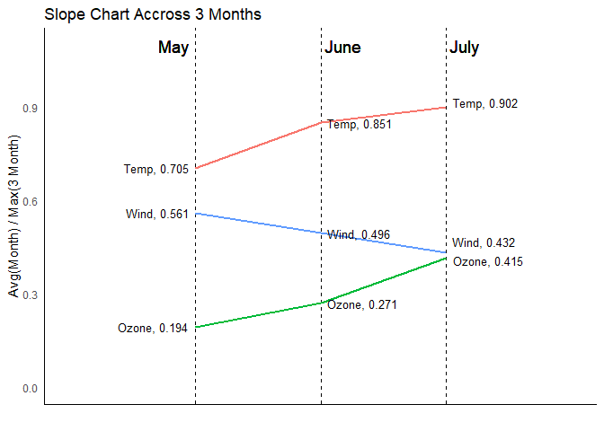
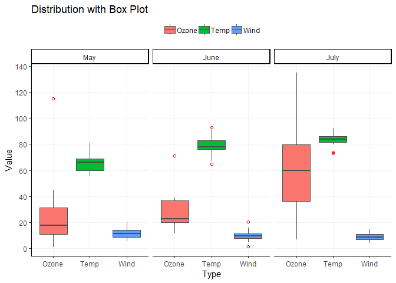
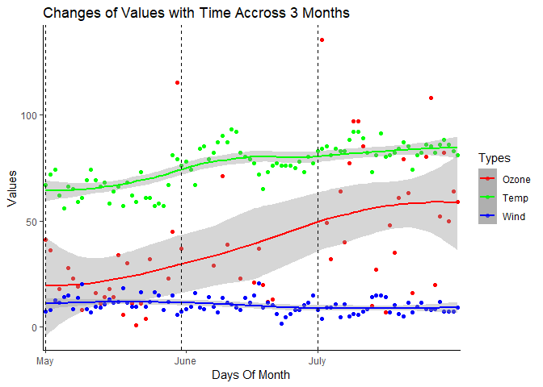

In this assignment we need to visualise the given dataset, before visualising the data we will first summarise the data to get the different statistics and check the overall data quality. </br>

``` r
#get library
library(ggplot2)
library(dplyr)
library(tidyr)
library(scales)
library(ggrepel)
```

Read the data from the file -

``` r
# Read the data from the csv file
data <- read.csv("D:/Ratul/MyGit/Data-Visualisation/Air_Quality_Data_Visualization/airqualityv2.csv")

# Add the Months Name in the dataset
data <- mutate(data, Month_Name = ifelse(Month==5,"May",ifelse(Month==6,"June","July")))

# Check the overall data
print(summary(data))
```

    ##      Ozone             Wind            Temp           Month  
    ##  Min.   :  1.00   Min.   : 1.70   Min.   :56.00   Min.   :5  
    ##  1st Qu.: 16.00   1st Qu.: 8.00   1st Qu.:68.00   1st Qu.:5  
    ##  Median : 32.00   Median : 9.70   Median :78.00   Median :6  
    ##  Mean   : 39.61   Mean   :10.28   Mean   :76.15   Mean   :6  
    ##  3rd Qu.: 59.00   3rd Qu.:12.00   3rd Qu.:83.25   3rd Qu.:7  
    ##  Max.   :135.00   Max.   :20.70   Max.   :93.00   Max.   :7  
    ##  NA's   :31                                                  
    ##       Day         Month_Name       
    ##  Min.   : 1.00   Length:92         
    ##  1st Qu.: 8.00   Class :character  
    ##  Median :16.00   Mode  :character  
    ##  Mean   :15.84                     
    ##  3rd Qu.:23.25                     
    ##  Max.   :31.00                     
    ## 

-   I have found there is a significant amount of data is missing for Ozone
-   By different studies we have seen the Ozone Value normally differ from Summar to Winter, so I can take the 3 months average to replace the missing values as the data is for a summar season.
-   I will also keep a set of replica with the missing values which I will use to plot the distribution as replacing significant amount of missing values will affect the distributions.

#### Replace the Missing Values with Mean

``` r
# Keep a set with NA Value
data_with_NA <- data

# Replace the missing(NA) values with the average of three month
data[which(!complete.cases(data)),"Ozone"] <- mean(data$Ozone,na.rm = T)

# Summarize the data
print(summary(data))
```

    ##      Ozone             Wind            Temp           Month  
    ##  Min.   :  1.00   Min.   : 1.70   Min.   :56.00   Min.   :5  
    ##  1st Qu.: 22.50   1st Qu.: 8.00   1st Qu.:68.00   1st Qu.:5  
    ##  Median : 39.61   Median : 9.70   Median :78.00   Median :6  
    ##  Mean   : 39.61   Mean   :10.28   Mean   :76.15   Mean   :6  
    ##  3rd Qu.: 39.70   3rd Qu.:12.00   3rd Qu.:83.25   3rd Qu.:7  
    ##  Max.   :135.00   Max.   :20.70   Max.   :93.00   Max.   :7  
    ##       Day         Month_Name       
    ##  Min.   : 1.00   Length:92         
    ##  1st Qu.: 8.00   Class :character  
    ##  Median :16.00   Mode  :character  
    ##  Mean   :15.84                     
    ##  3rd Qu.:23.25                     
    ##  Max.   :31.00

### Part I

#### Monthly average ozone, wind and temp for the months of May, June and July -

Here I am using the dataset where I have replaced all the missing values with the 3 month average value.

To plot the data we need to group by the data with Month and calculate the average of different types.

``` r
# Group the data By Month Name 
data_month <- data %>% group_by(Month_Name)

# Calculate the Monthly Average Order By Month Name
data_month_avg <- data_month %>% summarise(
          Ozone = mean(Ozone, na.rm = TRUE),
          Wind = mean(Wind, na.rm = TRUE),
          Temp = mean(Temp, na.rm = TRUE)) %>% 
          arrange(desc(Month_Name))

# Gather the data to Tidy the data to get the Type in the Column
data_month_avg_tidy <- gather(data_month_avg, key = Type, value = Average, Ozone:Temp)

# Check the Tidy Data
print(head(data_month_avg_tidy))
```

    ## # A tibble: 6 x 3
    ##   Month_Name Type  Average
    ##   <chr>      <chr>   <dbl>
    ## 1 May        Ozone   26.2 
    ## 2 June       Ozone   36.6 
    ## 3 July       Ozone   56.0 
    ## 4 May        Wind    11.6 
    ## 5 June       Wind    10.3 
    ## 6 July       Wind     8.94

``` r
# Plot the data to get Bar Plots for 3 different Types in 3 Different Months
ggplot(data = data_month_avg_tidy, aes(x = Month_Name, y = Average, fill = Type)) +
  geom_col(position="dodge", colour = "black") +
  geom_text(aes(label=round(Average,2)), position=position_dodge(width=0.9), vjust=-0.5) +
  scale_x_discrete(limits = c("May", "June", "July")) +
  labs(title = "Monthly Average of Ozone, Wind & Temp") +
  theme_light()
```


#### Observations:

-   We have found the Monthly Average for Ozone and Temperature has increased significantly assuming the missing values for Ozone is replaced by its 3 Months average.
-   On the other hand the Average Wind has decreased slightly for the 3 Months period.

### Part II

#### Diverging bar chart to compare Ozone and Temperature values with the 3 Months Average Value -

We will first prepare the data to get the deviation of the data from the 3 months average -

``` r
# Get the deviation from the Average Value of 3 Month Period for Ozone and Temperature
# Also added a Row_Number Column to get the day Values in X Axis
data_dev_from_avg <- mutate(data, 
                        Ozone_Dev = Ozone-mean(Ozone,na.rm = TRUE),
                        Ozone_Dev_Pos = ifelse((Ozone-mean(Ozone,na.rm = TRUE))>0,TRUE,FALSE),
                        Temp_Dev = Temp-mean(Temp,na.rm = TRUE),
                        Temp_Dev_Pos = ifelse((Temp-mean(Temp,na.rm = TRUE))>0,TRUE,FALSE),
                        id = row_number()
                        )
# Check The Data
print(head(data_dev_from_avg))
```

    ##      Ozone Wind Temp Month Day Month_Name  Ozone_Dev Ozone_Dev_Pos
    ## 1 41.00000  7.4   67     5   1        May   1.393443          TRUE
    ## 2 36.00000  8.0   72     5   2        May  -3.606557         FALSE
    ## 3 12.00000 12.6   74     5   3        May -27.606557         FALSE
    ## 4 18.00000 11.5   62     5   4        May -21.606557         FALSE
    ## 5 39.60656 14.3   56     5   5        May   0.000000         FALSE
    ## 6 28.00000 14.9   66     5   6        May -11.606557         FALSE
    ##     Temp_Dev Temp_Dev_Pos id
    ## 1  -9.152174        FALSE  1
    ## 2  -4.152174        FALSE  2
    ## 3  -2.152174        FALSE  3
    ## 4 -14.152174        FALSE  4
    ## 5 -20.152174        FALSE  5
    ## 6 -10.152174        FALSE  6

<b> Plot the Diverging Bar for Ozone </b>

``` r
# Plot the Diverging Bar for Ozone
ggplot(data_dev_from_avg, aes(x = id, y = Ozone_Dev, fill = Ozone_Dev_Pos)) +
  geom_col(position = "identity") +
  geom_vline(xintercept=1, linetype="dashed", size=.1) + 
                  geom_vline(xintercept=31, linetype="dashed", size=.1) +
                  geom_vline(xintercept=61, linetype="dashed", size=.1) +
  scale_x_discrete(limits=c(1,32,61), 
                   labels=c("May","June","July")) + # Define the Boundary for 3 months
  xlab("Days Of Month") +
  labs(title = "Deviation of Ozone from 3 Months Average")
```


<b> Plot the Diverging Bar for Temperature </b>

``` r
# Plot the Diverging Bar for Temperature
ggplot(data_dev_from_avg, aes(x = id, y = Temp_Dev, fill = Temp_Dev_Pos)) +
  geom_col(position = "identity") + 
  geom_vline(xintercept=1, linetype="dashed", size=.1) + 
                  geom_vline(xintercept=31, linetype="dashed", size=.1) +
                  geom_vline(xintercept=61, linetype="dashed", size=.1) +
scale_x_discrete(limits=c(1,32,61), 
                 labels=c("May","June","July")) + # Define the Boundary for 3 months
  xlab("Days Of Month") +
  labs(title = "Deviation of Temperature from 3 Months Average")
```


#### Observations:

-   For both Ozone and Temperature we have a positive trend accross the 3 Months we have found negetive deviation in the May and positive Deviation in June and July
-   As I have replaced the missing values with the 3 month average we can see there are lots of zero deviation for the Ozone Plot

### Part III

#### A slope chart to display the changes in Ozone, Temp and Wind for the 3 Month -

To create the slope chart we first have to create the data in proper format - </br>

``` r
# Calculate and append 3 Month Max Value to the Tidy dataset
data_month_avg_tidy$Max3Month <- ifelse(data_month_avg_tidy$Type=="Ozone",max(data$Ozone),
                                        ifelse(data_month_avg_tidy$Type=="Wind",
                                               max(data$Wind),max(data$Temp)))

# Add a computed Column to calculate - average for the month/3 month maximum value
data_month_avg_tidy$Avg_Max <- data_month_avg_tidy$Average/data_month_avg_tidy$Max3Month

# Check The Data
print(head(data_month_avg_tidy))
```

    ## # A tibble: 6 x 5
    ##   Month_Name Type  Average Max3Month Avg_Max
    ##   <chr>      <chr>   <dbl>     <dbl>   <dbl>
    ## 1 May        Ozone   26.2      135     0.194
    ## 2 June       Ozone   36.6      135     0.271
    ## 3 July       Ozone   56.0      135     0.415
    ## 4 May        Wind    11.6       20.7   0.561
    ## 5 June       Wind    10.3       20.7   0.496
    ## 6 July       Wind     8.94      20.7   0.432

``` r
# Remove the Aerage and Max3Month Column
data_month_avg_tidy <- data_month_avg_tidy[,-c(3,4)]

# Untidy the data to get the Month in  Column Level
data_month_avg_untidy <- spread(data_month_avg_tidy, key = Month_Name, value = Avg_Max)

# re-arrange the columns
data_month_avg_untidy <- data_month_avg_untidy[,c(1,4,3,2)]

print(head(data_month_avg_untidy))
```

    ## # A tibble: 3 x 4
    ##   Type    May  June  July
    ##   <chr> <dbl> <dbl> <dbl>
    ## 1 Ozone 0.194 0.271 0.415
    ## 2 Temp  0.705 0.851 0.902
    ## 3 Wind  0.561 0.496 0.432

I have added a new column class with different color just to differentiate the three Type - Ozone, Wind and Temperature </br>

``` r
# Add class Color Names for 3 different Types to differentiate
data_month_avg_untidy$class <- ifelse(data_month_avg_untidy$Type=="Ozone","Green",
                                  ifelse(data_month_avg_untidy$Type=="Temp","Blue","Red"))

# Save in a separate dataframe
data_slope <- data_month_avg_untidy

# create a vector of labels for May Data
May_label <- paste(data_month_avg_untidy$Type, 
                   round(data_month_avg_untidy$`May`,3),sep=", ")

# create a vector of labels for June Data
June_label <- paste(data_month_avg_untidy$Type, 
                    round(data_month_avg_untidy$`June`,3),sep=", ")

# create a vector of labels for July Data
July_label <- paste(data_month_avg_untidy$Type, 
                    round(data_month_avg_untidy$`July`,3),sep=", ")

print(head(data_slope))
```

    ## # A tibble: 3 x 5
    ##   Type    May  June  July class
    ##   <chr> <dbl> <dbl> <dbl> <chr>
    ## 1 Ozone 0.194 0.271 0.415 Green
    ## 2 Temp  0.705 0.851 0.902 Blue 
    ## 3 Wind  0.561 0.496 0.432 Red

</br>

<b>Plot the slope Chart - </b>

``` r
# Plot the slope Chart 
theme_set(theme_classic())

p <- ggplot(data_slope) + 
                  geom_vline(xintercept=1, linetype="dashed", size=.1) + 
                  geom_vline(xintercept=2, linetype="dashed", size=.1) +
                  geom_vline(xintercept=3, linetype="dashed", size=.1) +
  
                  labs(x="", y="Avg(Month) / Max(3 Month)") +  # Axis labels
                  xlim(0, 4) +
                  ylim(0.0,1.1)  # X and Y axis limits

p <- p + geom_segment(aes(x=1, xend=2, y=`May`, yend=`June`, col=class), 
                      size=.75, show.legend=F) + 
          geom_segment(aes(x=2, xend=3, y=`June`, yend=`July`, col=class), 
                       size=.75, show.legend=F)  

# Add texts
p <- p + geom_text(label=May_label, y=data_slope$`May`, x=rep(1, NROW(df)), 
                   hjust=1.1, size=3.5) +
          geom_text(label=June_label, y=data_slope$`June`, x=rep(2, NROW(df)), 
                    hjust=-0.1, size=3.5) +
          geom_text_repel(label=July_label, y=data_slope$`July`, x=rep(3, NROW(df)), 
                    hjust=-0.1, vjust=0,size=3.5) +

          geom_text(label="May", x=1, y=1.1, hjust=1.2, size=5) +  # title of left line
          geom_text(label="June", x=2, y=1.1, hjust=-0.1, size=5) + # title of right line
          geom_text(label="July", x=3, y=1.1, hjust=-0.1, size=5)  # title of right line

# Minify theme
p + theme(panel.background = element_blank(), 
           panel.grid = element_blank(),
           axis.ticks = element_blank(),
           axis.text.x = element_blank(),
           panel.border = element_blank()) +
  labs(title = "Slope Chart Accross 3 Months")
```



#### Observations:

-   The above visualization shows the same trends of Temperature, Ozone and Wind with respect to three months as we have found in Part I
-   As the data has been some what normalised the changes or the slope of the curves are more dominant than the graph we have generated in part I

### Part IV

#### Plot the distributions per month of temp, ozone and wind

I am visualizing the distribution considering the missing Values as replacing the missing values can change the actual distribution significantly as we have many numbers of missing Values

First I will prepare the data in correct format

``` r
# Filter Out The May Data 
data_May <- data_with_NA %>% filter(Month == 5) %>% 
  gather(key = Type,value = Value, Ozone:Temp) %>% 
  select(Type, Value, Month, Month_Name)

# Filter Out The June Data 
data_June <- data_with_NA %>% filter(Month == 6) %>% 
  gather(key = Type,value = Value, Ozone:Temp) %>% 
  select(Type, Value, Month, Month_Name)

# Filter Out The July Data 
data_July <- data_with_NA %>% filter(Month == 7) %>% 
  gather(key = Type,value = Value, Ozone:Temp) %>% 
  select(Type, Value, Month, Month_Name)

# Combine all the data for 3 Months
data_Month <- rbind(data_May,data_June,data_July)

print(head(data_Month))
```

    ##    Type Value Month Month_Name
    ## 1 Ozone    41     5        May
    ## 2 Ozone    36     5        May
    ## 3 Ozone    12     5        May
    ## 4 Ozone    18     5        May
    ## 5 Ozone    NA     5        May
    ## 6 Ozone    28     5        May

<b> Distribution with Bar Plot </b>

``` r
ggplot(data_Month, aes(x=data_Month$Value, 
                       color = data_Month$Type)) +
  geom_histogram(binwidth=2,fill=NA, alpha=0.8, 
                 position="identity") +
  facet_wrap(~ factor(Month_Name, 
                      levels= c("May","June","July"))) +
  theme_classic()+
  scale_colour_manual(values= c("#0571b0","#ca0020","green")) +
  theme(legend.position="top", legend.title = element_blank()) +
  labs(x="Value", y = "Counts", title = "Distribution Plot", 
       subtitle = "Distribution with Bar Plots")
```


#### Observations:

-   As we have not replaced the Missing Values for the Ozone it is more flat than the other values, but for Temperature and Wind the data shown a near normal pattern

<b> Distribution with Box Plot </b>

``` r
# Plot the Box Plot 
p <- ggplot(data_Month, aes(x = Type, y = Value)) +
      geom_boxplot(aes(fill = Type,color = Type), colour = "gray30", 
                      outlier.colour = "red", outlier.shape = 1) +
    facet_wrap(~ factor(Month_Name, 
                        levels= c("May","June","July"))) +
  scale_y_continuous(breaks = c(0,20,40,60,80,100,120,140)) +
  
  theme_classic() +
  theme(
    legend.position="top",legend.title = element_blank(),
    panel.grid.major.y =element_line(colour = "gray95"),
    panel.grid.major.x =element_line(colour = "gray95")
  ) +
  labs(title = "Distribution with Box Plot")

p
```



#### Observations:

-   Here as we have plotted the data with the help of box plot, the overall trend can be found from the medium value
-   We can also get an idea about the range of the data, we can see the Ozone data is more scattered in nature and has a long whisker compared to other.
-   The wind data follows almost normalised in nature for all the three months
-   We can also find the outliers highlighted in red circles

<b> Distribution with Strip Plot </b>

``` r
ggplot(data_Month, aes(x=data_Month$Value, y=data_Month$Type)) + 
  geom_point(aes(col=data_Month$Type), alpha=0.3, 
             size = 3, show.legend=F) +
  coord_fixed(ratio=10)+
  facet_grid(factor(Month_Name, levels= c("May","June","July")) ~ .) +
  labs(x="Values From Smallest to Largest", 
       title = "Distribution Plot", 
       subtitle = "Distribution with Strip Plot") +
  
  theme_classic() +

theme(
  axis.text.y = element_text(size =10,face = "bold"),
  axis.ticks.y =  element_blank(),
  axis.title.y = element_blank(),
  axis.title.x = element_text(size = 10)
)
```


#### Observations:

-   we have faceted the data with respect to Month
-   we have ploted the Strip Plot and we are able to find the min and max values as well
-   We are also get an idea about the data distribution.

### Part V

#### A plot showing the temporal aspect of the data. </br>

To get the temporal aspect of the data I am plotting the data of the three months as a scatter points and then adding a regression line to get as overall trend of the average data.

``` r
data_with_ID <- mutate(data_with_NA,
                       dayId= row_number())

# Create a vector to add legends
cols <- c("Ozone"="red","Wind" = "blue", "Temp" = "green")

# Plot
ggplot(data= data_with_ID, aes(x= dayId )) +
  geom_point(aes(y = Ozone,color = "Ozone") ) +
  stat_smooth(aes(y = Ozone , color = "Ozone")) +
  geom_point(aes(y = Wind , color = "Wind")) +
  stat_smooth(aes(y = Wind , color = "Wind")) +
  geom_point(aes(y = Temp , color = "Temp")) +
  stat_smooth(aes(y = Temp , color = "Temp")) +
  scale_colour_manual(name="Types",values=cols) +
  geom_vline(xintercept=1, linetype="dashed", size=.1) + 
                  geom_vline(xintercept=31, linetype="dashed", size=.1) +
                  geom_vline(xintercept=61, linetype="dashed", size=.1) +
  scale_x_discrete(limits=c(1,32,61), labels=c("May","June","July")) +
  labs(x="Days Of Month", y = "Values", 
       title = "Changes of Values with Time Accross 3 Months") 
```



#### Observations:

-   Here also we have found the same trend as the Ozone and Temperature gradually increased and the wind decresed a little over the three months.
-   As we have plotted the scatter plot we can also get an idea about the scatterness of the data

</br> </br></br>
