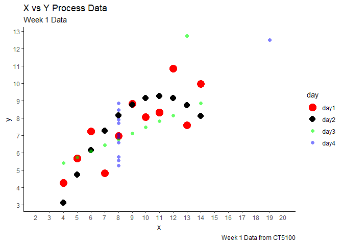

In this task we are trying to visualise some categorical data to distinguish them from others using human perception and asthetics. I am trying to use different asthetic properties in R to use these human perceptions to categorize the data as much as possible.

<b> Part 1 </b> -

Step 1 -

Ploting the values with the default theme of R -

``` r
#Read from CSV
week1 <- read.csv("D:/Ratul/MyGit/Data-Visualisation/Anscombe_Quartet_Visualization/week1.csv")

#visualise
gg <- ggplot(data = week1, aes(x=x_values, y = y_values)) +
  geom_point(aes(color = day)) +
  labs(subtitle="Week 1 Data", 
       y="Y", 
       x="X", 
       title="X vs Y Process Data", 
       caption = "Source: Week 1 Data from CT5100") +
  theme_classic()

plot(gg)
```


The main issue with the above visualization is the 4 categories of data are not distinguishable. All the color selections are soothing in nature which makes a calming impression in human perception. So we are unable to locate the different category. The sizes are also small which is hard to categorise.

Step 2 -

Here I have decided to increase the size of the dots to make it more prominent. Also I have choose four different colors - Red which arouse more stimulating effect in terms of human perception - selected it for Day 1 as its more scattered over the other data points so that we can identify it more easily, black for day 2 which got highlighted in contrast to the white background, Yellow and Green for Day4 and Day3 as those two data are mostly follows a pattern and easier to find in the overall area.

``` r
#visualise

gg <- ggplot(data = week1, aes(x=x_values, y = y_values)) +
  geom_point(aes(color = day), size = 3) +
  scale_color_manual(values=c('red', 'black', 'green','yellow')) +  # manually set the colors
  labs(subtitle="Week 1 Data", 
       y="Y", 
       x="X", 
       title="X vs Y Process Data", 
       caption = "Source: Week 1 Data from CT5100") +
  theme_classic()

plot(gg)
```


Step 3 -

The above plot looks good but as there are some overlap between few points its a bit difficult to separate those instances. So I have decided to chose different shapes and sizes so that it will not get overlapped.

``` r
gg <- ggplot(data = week1, aes(x=x_values, y = y_values)) +
  geom_point(aes(color = day, size = day, shape = day)) +
  scale_color_manual(values=c('red', 'black', 'green','blue')) +  # manually set the colors
  scale_shape_manual(values=c(16, 17, 15, 16)) + # manually set the shapes
  scale_size_manual(values=c(5,4,3,2)) + # manually set the sizes using a vector of point sizes
  labs(subtitle="Week 1 Data", 
       y="Y", 
       x="X", 
       title="X vs Y Process Data", 
       caption = "Source: Week 1 Data from CT5100") +
  theme_classic()

plot(gg)
```


<b>Part 2: </b>

Highlight the data for Day 1 and Day 2 from rest of the data

Approach I -

In this approach I am using Red and Black Color to distinguish the Day 1 and Day 2 and the color Green and Blue for Day 3 and Day 4 as Red and Black (With Respect to the White Back Ground) makes more arousing or stimulating effect compared to the other colors Green and Blue which mostly gives soothing or calming impression to human perception. I have also used comparatively large size for Day 1 and Day 2 to differentiate them from rest of the group.

``` r
# Base plot 
gg <- ggplot(week1, aes(x=x_values, y=y_values)) + 
  geom_point(aes(col=day, shape=day, size = day )) +   # Set shape and colour according to day value  ,  size=(2)
  
  scale_shape_manual(values=c(16, 17, 18, 16)) + # manually set the shapes
  
  scale_color_manual(values=c('red', 'black', 'green',"blue")) +  # manually set the colors #7cfc00
  
  scale_size_manual(values=c(5,4,3,3))+ # manually set the sizes using a vector of point sizes

  coord_cartesian(xlim=c(2,20))  + 
   labs(title="X vs Y Process Data", subtitle="Week 1 Data", y="y", x="x", caption="Week 1 Data from CT5100")

gg <-gg +  
  scale_x_continuous(breaks=seq(2, 30, 1)) + 
  scale_y_continuous(breaks=seq(3, 13, 1))

gg + theme_classic()
```


Approach II -

Another approach is to change the alpha value for changing the transparency to highlight the data for Day 1 and Day 2 over Day 3 and Day 4, we are not changing the shapes for different days here.

``` r
# Base plot 
gg <- ggplot(week1, aes(x=x_values, y=y_values)) + 
  geom_point(aes(col=day, shape=day, size = day, alpha = day )) +   # add color, shape , size and alpha in asthetics to change them manually
  
  scale_shape_manual(values=c(16, 16, 16, 16)) + # manually set the shapes
  
  scale_color_manual(values=c('red', 'black', 'green',"blue")) +  # manually set the colors
  
  scale_size_manual(values=c(5,4,2,2))+ # manually set the sizes using a vector of point sizes
  
  scale_alpha_manual(values = c(1,1,.6,.5)) +

  coord_cartesian(xlim=c(2,20))  + 
   labs(title="X vs Y Process Data", subtitle="Week 1 Data", y="y", x="x", caption="Week 1 Data from CT5100")

gg <-gg +  
  scale_x_continuous(breaks=seq(2, 30, 1)) + 
  scale_y_continuous(breaks=seq(3, 13, 1))

gg + theme_classic()
```



Comparisison between the approach I and approach II -

In the first approach we only relies on the size and shape to highlight the Day 1 & Day 2 data, but in approach II we have also tried to add the alpha value to change the transparency value. We keep the transparency to minimum for Day1 and Day 2 and place a higher transparency for Day 3 and Day 4. So the Day 1 and Day 2 got highlighted. As there are four categories changing the shape may not work to highlight two categories from other two. If we have to highlight only one category changing shape may helps.

The above approach may differ from one person to other as visualization depends on human perception and depends on the intended audience. But still from the science of human perception above approaches do add values.
