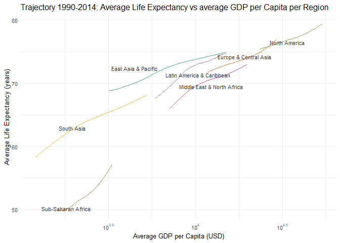
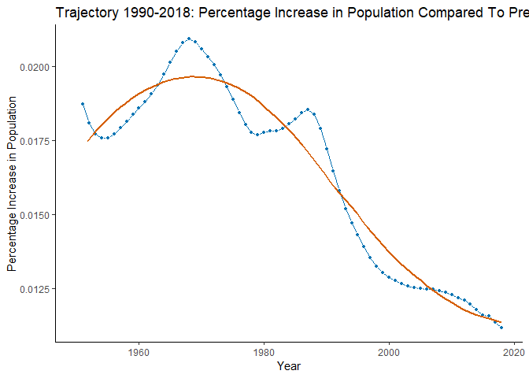
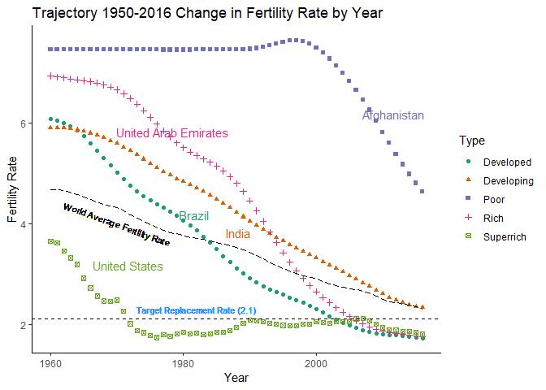
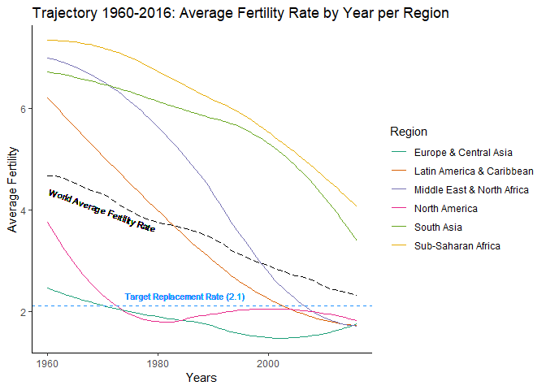

Introduction:
=============

GDP (Gross Domestic Product) per capita is used as global indicator by economists and social scientits. Eventhough it is cited popularly, this is not a true reflection of any countries social equality. HDI (Human Development Index) is a more balanced indicator for social parameters. In this exercise we have used GDP for analyzing social upliftment of wealth as well as life expectency. Also this experiment attempts to explore the theory of resource constrained convergence of fertility rate and world population.

Experiment:
===========

Load required packages.

``` r
suppressMessages(require(dplyr))
suppressMessages(require(tidyr))
suppressMessages(require(ggplot2))
suppressMessages(require(scales))
suppressMessages(require(ggrepel))
```

Answer 1:
---------

In this plot we are attempting to show that all regions of the world are heading in the direction of higher GDP and higher Life Expectancy.

-   The data (nations.csv) used for this plot was provided as part of lecture 7.

``` r
nations_data <- read.csv("dataset/nations.csv", stringsAsFactors = FALSE)

regions<-nations_data %>% 
  select(region,year, population, gdp_percap, life_expect) %>% 
  group_by(year, region) %>% 
  summarize(totalPop = sum(population,na.rm = TRUE), ave_gdp_percap = weighted.mean(gdp_percap, population, na.rm = TRUE), ave_life_expect = weighted.mean(life_expect, population,na.rm = TRUE ))


regions_2002 <- regions[regions$year==2002,]


p.regions.ave <-ggplot(regions, aes(x=ave_gdp_percap, y=ave_life_expect, color=region)) +  
  ggtitle("Trajectory 1990-2014: Average Life Expectancy vs average GDP per Capita per Region") + 
  xlab("Average GDP per Capita (USD)") + 
  ylab("Average Life Expectancy (years)") +
  # note how scale breaks are inserted
  scale_x_log10(labels = trans_format("log10", math_format(10^.x)), breaks =           scales::trans_breaks("log10", function(x) 10^x)) +
  scale_color_brewer(palette='Dark2', guide=FALSE) + 
  #scale_size_area(max_size = 8, labels  = comma, name="Population per Region") +
  

  geom_line(size = 0.7  , stat="smooth",method = "loess",se=FALSE, show.legend =FALSE, na.rm = TRUE,  alpha = 0.8) +

  
  geom_text_repel(data=regions_2002,aes(label=region), size= 3, 

                  colour="black", alpha=0.8, na.rm = TRUE, show.legend = FALSE)  +
  
  theme_minimal(base_size=10) 

plot(p.regions.ave)
```



Answer 2:
---------

In this plot we have attempted to show the trend of percentage increase in World Population by Year from 1950 till 2016.

-   The data (UNdata\_Export\_World\_Pop.csv) used for this plot was collected from UN data bank.
-   [UN-Population](http://data.un.org/Data.aspx?q=world+population&d=PopDiv&f=variableID%3a12%3bcrID%3a900)

Following formuale is used to calculate the rate of change \* Fractional Change in Population = (Current Yeat Population - Previous Year Population)/Previous Year Population

``` r
data_pop <- read.csv("dataset/UNdata_Export_World_Pop.csv", stringsAsFactors = FALSE)


colnames(data_pop) <- c('Area','Year','Variant','Value')


filter <- (data_pop$Year>1949) & (data_pop$Year < 2019)

data_pop_filter <- data_pop[filter,]


filter <- (data_pop$Variant == "No change")

data_pop_filter <- data_pop_filter[filter,]

data_pop_filter <- data_pop_filter[complete.cases(data_pop_filter),]


data_pop_filter$Value <- as.double(data_pop_filter$Value)


data_pop_filter <- data_pop_filter[order(data_pop_filter$Year),]


data_pop_filter$Growth <- with(data_pop_filter, ave(Value, 
                          FUN=function(x) c(NA, diff(x)/x[-length(x)]) ))


ggplot(data=data_pop_filter,aes(y=Growth,x=Year), na.rm = TRUE)+
  geom_line(color = "#0072B2") +
  geom_point(color = "white", fill = "#0072B2", shape = 21, size = 1.75) +

  geom_smooth(fullrange=TRUE, se=FALSE, color = "#D55E00") +

  theme_classic() +
  ggtitle("Trajectory 1990-2018: Percentage Increase in Population Compared To Preious year") + 
  xlab("Year") + 
  ylab("Percentage Increase in Population")
```

    ## `geom_smooth()` using method = 'loess' and formula 'y ~ x'



#### Observation

-   The rate of change is increasing at a increasing rate between 1960-to-1970 and-around 1980-to-1990.

-   The rate of change is increasing at a decreasing rate between 1970-to-1980 and-around 1990-to-present.

-   From the fitted regression line we infer that the rate of change has significantly slowed down around 2010 and is moving towards a steady state.

### Answer 2:

In this plot we have attempted to show the trend of changing Fertility Rate from 1950 till present for countries selected on various GDP scale over the spectrum.

-   The data (WorldBank\_Fertility - 1960-2016.csv) used for the Fertility plot was collected from WorldBank.
-   [WorldBank-Fertility](https://databank.worldbank.org/data/reports.aspx?source=2&series=SP.DYN.TFRT.IN#)

-   The data (UNdata\_GDP\_PerCapita\_CurrentPrice.csv) used for the GDP per Capita was collected from United Nations.
-   [UN-GDPperCapita](http://data.un.org/Data.aspx?q=gdp+per+capita&d=SNAAMA&f=grID%3a101%3bcurrID%3aUSD%3bpcFlag%3a1)

**It is important to note that we could not find yearwise fertility data set from 1950 till date. Instead we found yearwise fertility dataset from 1960 till date.**

From GDP dataset we have devided countires as poor, rich etc based on the following criteria. \* Poor : GDP PC &lt;= 1k$ \* Developing : 1k$ &lt; GDP PC &lt;= 5k$ \* Developed : 5k$ &lt; GDP PC &lt;= 25k$ \* Rich : 25k$ &lt; GDP PC &lt;= 50k$ \* Super Rich : 50k$ &lt; GDP PC

The regions of the world is taken from the nations.csv used in Question 1.

``` r
### Code Start Rajarshi Hazra ###
get_countries_byGdpPc <- function() {
  gdp <- read.csv(file="dataset/UNdata_GDP_PerCapita_CurrentPrice.csv", header=TRUE, sep=",")
  
  # Take the GDP data for 2017 only
  gdp_2017 <- gdp[gdp$Year == 2017,]
  countries <- nrow(gdp_2017)
  
  # Counties are categorized based on GDP per capita.
  # Poor       :        GDP PC <=  1k$
  # Developing :  1k$ < GDP PC <=  5k$
  # Developed  :  5k$ < GDP PC <= 25k$
  # Rich       : 25k$ < GDP PC <= 50k$
  # Super Rich : 50k$ < GDP PC
  
  gdp_2017_poor <- gdp_2017[gdp_2017$Value <= 1000,]
  poor <-  as.character(gdp_2017_poor$Country.or.Area)
  
  gdp_2017_developing <- gdp_2017[((gdp_2017$Value > 1000) & (gdp_2017$Value <= 5000)),]
  developing <- as.character(gdp_2017_developing$Country.or.Area)

  gdp_2017_developed <- gdp_2017[((gdp_2017$Value > 5000) & (gdp_2017$Value <= 25000)),]
  developed <- as.character(gdp_2017_developed$Country.or.Area)

  gdp_2017_rich <- gdp_2017[((gdp_2017$Value > 25000) & (gdp_2017$Value <= 50000)),]
  rich <- as.character(gdp_2017_rich$Country.or.Area)

  gdp_2017_superrich <- gdp_2017[(gdp_2017$Value > 50000),]
  superrich <- as.character(gdp_2017_superrich$Country.or.Area)
  
  sprintf("Total Counties : %s", countries)
  sprintf("Poor           : %s", length(poor))
  sprintf("Developing     : %s", length(developing))
  sprintf("Developed      : %s", length(developed))
  sprintf("Rich           : %s", length(rich))
  sprintf("Superrich      : %s", length(superrich))
  
  list(Poor=poor,Developing=developing,Developed=developed,Rich=rich,Superrich=superrich)
}

get_GdpPc_byCountryName <- function(n) {
  gdp <- read.csv(file="dataset/UNdata_GDP_PerCapita_CurrentPrice.csv", header=TRUE, sep=",")
  gdp_2017 <- gdp[gdp$Year == 2017,]
  value <- vector(mode="numeric", length=0)
  for (i in 1:length(n)) {
    value <- c(value, as.numeric(gdp_2017[gdp_2017$Country.or.Area == n[i],]$Value))
  }
  value
}

categories <- get_countries_byGdpPc()

names_all <- c("Madagascar","Afghanistan",
           "India","Ukraine",
           "Brazil","Latvia",
           "France","United Arab Emirates",
           "United States","Switzerland")

names <- c("Afghanistan",
           "India",
           "Brazil",
           "United Arab Emirates",
           "United States") 
gdps <- get_GdpPc_byCountryName(names)
types <- c("Poor",
           "Developing", 
           "Developed",
           "Rich",
           "Superrich")

# Let us build a data frame with all details which will be investigated for Fertility.
countries <- data.frame(Name=names,GdpPerCapita=gdps,Type=types)

world_fertility_orig <- read.csv(file="dataset/WorldBank_Fertility - 1960-2016.csv", header=TRUE, sep=",",stringsAsFactors=F)

fertility <- world_fertility_orig

fertility <-  as.data.frame(fertility)


year <- as.character(seq(1960,2018,1))
heading <- c("SeriesName","SeriesCode","CountryName","CountryCode", year)
length(heading)
```

    ## [1] 63

``` r
length(colnames(fertility))
```

    ## [1] 63

``` r
colnames(fertility) <- heading
years <- as.character(seq(1960,2016,1))
fertility <- fertility %>% select(CountryName,years)

long_fertility <- fertility %>% filter(CountryName %in% names) 
long_fertility <- long_fertility %>% gather(Year, FertilityRate, "1960":"2016")


long_fertility <- data.frame(long_fertility[1], lapply(long_fertility[2:3], 
                                function(x) as.numeric(x)))

long_fertility <-  merge(long_fertility, countries, by.x=c("CountryName"),
      by.y=c("Name"))

countries_name <- countries

colnames(countries_name) <- c("CountryName", "GdpPerCapita","Type")

long_fertility_2000 <- long_fertility[long_fertility$Year == 2000,]

world_fertility <- fertility

get_countries_byRegion <- function() {
  nations <- read.csv(file="dataset/nations.csv", header=TRUE, sep=",", stringsAsFactors=F)
  countries <- as.character(nations$country)
  regions <- as.character(nations$region)
  
  unique_countries <- unique(countries)
  index <- vector(mode = "numeric", length=0)
  for (i in 1:length(unique_countries)) {
    for (j in 1:length(countries))
      if (countries[j] == unique_countries[i]) {
        index <- c(index, j)
        break
      }
  }
  country_region <- vector(mode = "character", length=0)
  for (i in 1:length(index)) {
    country_region <- c(country_region, regions[index[i]])
  }
  country_by_region <- list(Country=unique_countries,Region=country_region)
  country_by_region
}

### Code End Rajarshi Hazra ###

### Code Start Shubhajit Basak ###
cByr <- as.data.frame(get_countries_byRegion())

world_fertility_regional <- merge(world_fertility, cByr, by.x=c("CountryName"), by.y=c("Country"))

world_fertility_regional <- world_fertility_regional %>% 
  select(CountryName,Region,everything())


long_world_fertility_regional <- world_fertility_regional %>% filter(CountryName %in% names_all) 

long_world_fertility_regional <- long_world_fertility_regional %>% gather(Year, FertilityRate, "1960":"2016")
# str(long_world_fertility_regional)

long_world_fertility_regional$FertilityRate <- as.numeric(long_world_fertility_regional$FertilityRate)
long_world_fertility_regional$Year <- as.numeric(long_world_fertility_regional$Year)
  
fertility_regional <- long_world_fertility_regional %>% 
  group_by(Year, Region) %>% 
  summarize(Ave_Fertility_Region = weighted.mean(FertilityRate, na.rm = TRUE))

# head(fertility_regional)

fertility_world <- long_world_fertility_regional %>%
  select(Year,FertilityRate) %>%
  group_by(Year) %>% 
  summarize(Ave_Fertility = weighted.mean(FertilityRate, na.rm = TRUE))
### Code End Shubhajit Basak ###
```

We have selected following countries based on our logic.

-   Afghanistan - Poor

-   India - Developing

-   Brazil - Developed

-   United Arab Emirate - Rich

-   United States - Superrich

``` r
ggplot(data=long_fertility,aes(y=FertilityRate,x=Year #,
                                    # shape = Type,
                                    # color = Type
                                    
                                    )) +
  
  geom_point(aes(shape= Type, color = Type)) +
  
  geom_text(label="Target Replacement Rate (2.1)", x =1982,y=2.3,color= "dodgerblue", size=3)+

  geom_text_repel( data = long_fertility_2000, aes(label = CountryName, color = Type),
                   show.legend = FALSE,
                   x=c(2010,1980,1990,1980,1970),
                   y = c(6, 4, 4, 6,3 )
             
             ) +
  
  scale_color_brewer(palette = "Dark2") +
  geom_hline(yintercept=2.1, linetype="dashed", color = "black") +
  
  theme_classic() +
  ggtitle("Trajectory 1950-2016 Change in Fertility Rate by Year") + 
  xlab("Year") + 
  ylab("Fertility Rate") +
  
  geom_line(data=fertility_world, aes(x=Year, y=Ave_Fertility),linetype="longdash") +
  geom_text(label="World Average Fertility Rate", x=1970, y=4, color="black", size=3, angle=-20)
```



#### Observation

-   Overall for all the countries the fertility rate is going down and kind of converging to wards 2.1.

-   The fertility rate trend for developed, rich and superrich nations are decreasing below 2.1.

-   Also the World fertility rate is converging towards 2.1.

It might not be wise to predict future but with current trend we say safely that world population which is driven by fertility rate is going towards a steady state.

### Answer 4:

In this plot we have attempted to show the trend of changing Fertility Rate from 1950 till present for the various regions of the world.

-   The data prepared for question no three is used here for the plot.

``` r
fertility_regional
```

    ## # A tibble: 342 x 3
    ## # Groups:   Year [57]
    ##     Year Region                     Ave_Fertility_Region
    ##    <dbl> <fct>                                     <dbl>
    ##  1  1960 Europe & Central Asia                      2.37
    ##  2  1960 Latin America & Caribbean                  6.07
    ##  3  1960 Middle East & North Africa                 6.93
    ##  4  1960 North America                              3.65
    ##  5  1960 South Asia                                 6.68
    ##  6  1960 Sub-Saharan Africa                         7.3 
    ##  7  1961 Europe & Central Asia                      2.38
    ##  8  1961 Latin America & Caribbean                  6.05
    ##  9  1961 Middle East & North Africa                 6.91
    ## 10  1961 North America                              3.62
    ## # ... with 332 more rows

``` r
ggplot(fertility_regional, aes(x=Year, y=Ave_Fertility_Region)) + 
  ggtitle("Trajectory 1960-2016: Average Fertility Rate by Year per Region") + 
  xlab("Years") + 
  ylab("Average Fertility") +
  scale_color_brewer(palette="Dark2") +
  theme_classic() +
  geom_line(size=0.5, stat="smooth", method="loess", se=FALSE, show.legend=TRUE, na.rm=TRUE, aes(color=Region)) +
  geom_hline(yintercept=2.1,linetype="dashed",color="dodgerblue") +
  geom_text(label="Target Replacement Rate (2.1)", x=1985, y=2.3, color="dodgerblue", size=3) +
  geom_line(data=fertility_world, aes(x=Year, y=Ave_Fertility),linetype="longdash") +
  geom_text(label="World Average Fertility Rate", x=1970, y=4, color="black", size=3, angle=-20)
```



#### Observation

-   Apart from NOrth America and Europe & Central Asia, for all the regions the fertility rate is constantly going down.

-   Also the World fertility rate is converging towards 2.1.

Conclusion:
===========

From the plots above we can see that the percentage increase in population is going down along with the fertility rate eventhough the life expectancy and wealth is growing. These two opposite trends shows that the increasing wealth leads towards a smaller family.

GDP (Gross Domestic Product) per capita is used as global indicator by economists and social scientits. Eventhough it is cited popularly, this is not a true reflection of any countries social equality. HDI (Human Development Index) is a more balanced indicator for social parameters. In this exercise we have used GDP for analyzing social upliftment of wealth as well as life expectency. Also this experiment attempts to explore the theory of resource constrained convergence of fertility rate and world population.
