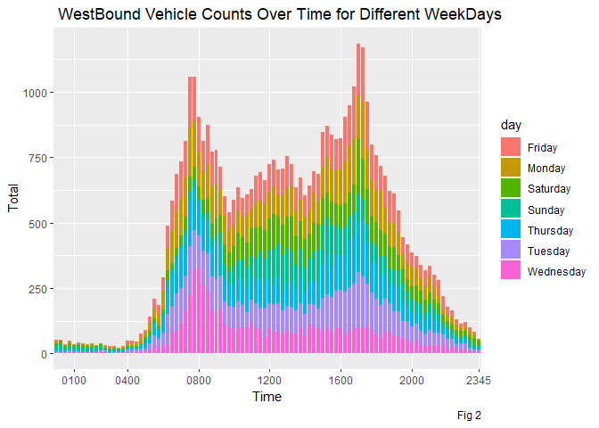
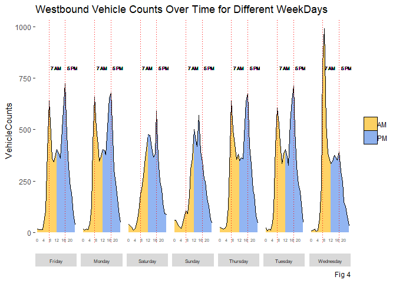
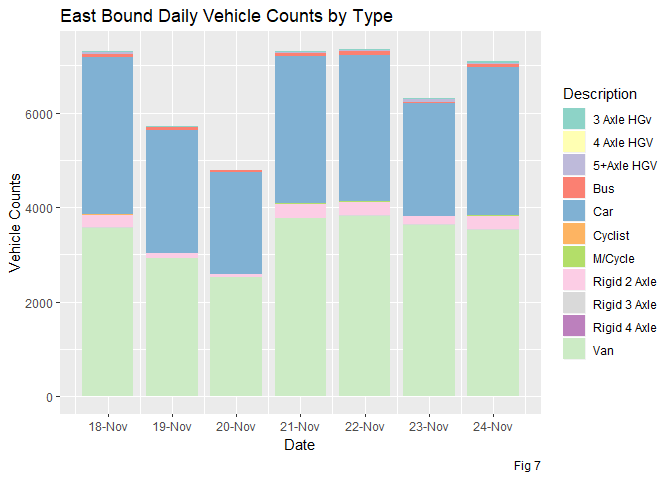
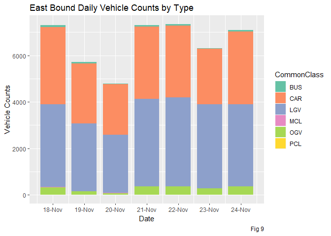
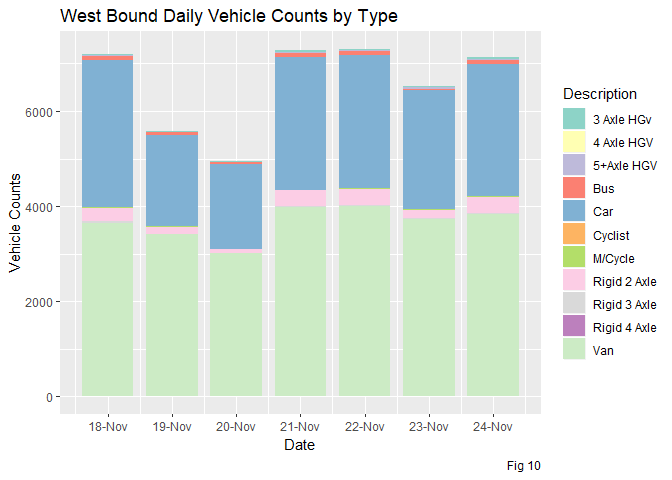
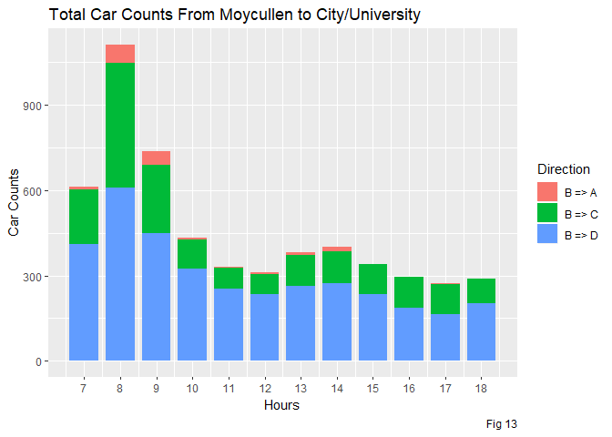
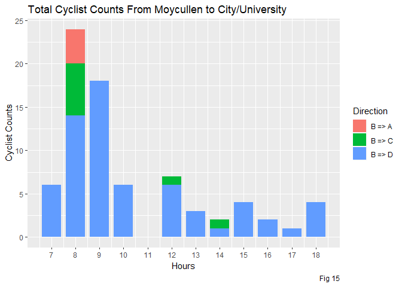

In this assignment we are studying the Real Traffic Data on the N59 just before and at the junction outside the Insight building in the IDA Business park in Dangan. Following figure showsthe exact location -  
  


  
  
  
The main road through the junction is the N59. Traffic coming from direction B is from the  (North Western) townlands around the N59  and the larger towns of Clifden, Oughterard and Moycullen.

* Traffic turning into A is going to the IDA Business Park, including the Data Science Institute (Insight)
* Traffic turning towards C  can head toward the central part of the university campus and Galway city
* Traffic heading towards D can enter the northern part of the university campus at Corrib village. This traffic also goes to the city
  

As the excel proided is difficult to parse I have manually created an excel with the same data with four Tabs -

1. EastBound - contaning the EastBound Vehicle Data as shown below -  
  
  


  
    
2. WestBound - contaning the WestBound Vehicle Data as shown below -  
  
  

  
  
3. Vehicle Type - To get the vehicle Class type -  
  
  


  -  I have considered all the Other Goods Vehicle with in single category as OGV and all the different types of Buses as Bus  
  

4. Turning Data - As Shown below -  
  
  


### Part I - Determine the Period of Traffic Congestion

To get an idea of the period of traffic congestion at the junction I am considering the number of vehicle counts in both East and West Bound traffic and visualising the same -  
  


```r
suppressMessages(require(readxl))
suppressMessages(require(ggplot2))
suppressMessages(require(dplyr))
suppressMessages(require(stringi))
suppressMessages(require(lubridate))
suppressMessages(require(tidyr))
suppressMessages(require(RColorBrewer))
suppressMessages(require(ggridges))
```

#### Read the data -


```r
setwd("D:/Ratul/MyGit/Data-Visualisation/TrafficDataAnalysis")
my_data_eastbound <- read_excel("Data_Preprocess.xlsx",sheet = 1)
my_data_westbound <- read_excel("Data_Preprocess.xlsx",sheet = 2)
```


```r
#Extract Day of Week
dow <- function(x) format(as.Date(x), "%A")
#Get the Day of Week in both the data
my_data_eastbound$day <- dow(my_data_eastbound$Day)
my_data_westbound$day <- dow(my_data_westbound$Day)
```

Lets plot a simple line graph for different days of week - 


```r
ggplot(data = my_data_eastbound, aes(x=Time, y = Total, fill=day))+
  geom_bar(stat = "identity", width=0.8) +
  scale_x_discrete(breaks=c('0100','0400','0800','1200','1600','2000','2345')) +
  ggtitle(" Eastbound Vehicle Counts Over Time for Different WeekDays") +
  labs(caption = "Fig 1")
```

<!-- -->

```r
ggplot(data = my_data_westbound, aes(x=Time, y = Total, fill=day))+
  geom_bar(stat = "identity", width=0.8) +
  scale_x_discrete(breaks=c('0100','0400','0800','1200','1600','2000','2345')) +
  ggtitle(" WestBound Vehicle Counts Over Time for Different WeekDays") +
  labs(caption = "Fig 2")
```

<!-- -->

#### Observation: 

* We can see there is definitive spikes during 7-8 AM early morning and 4-6 PM evening in both the direction
* The Count is comparatively low in weekend 
* There is a spike in Wednesday in Morning for West Bound Traffic, one reason mat be normally transporters ans suppliers delivers their assignments on Wednesday


  
Though the graph gives some idea about the peak hours its bit difficult to interpret for individual day, lets try to facet the data by day and get an overall count of traffics in both the way.  
  
  
##### Prepare the data for East Bound Traffic - 


```r
my_data_eastbound_upd <- my_data_eastbound %>% select (Day,day,Time,Total,`Cls-1`:`Cls-11`)

# Create Date Time Stamp 
stri_sub(my_data_eastbound_upd$Time, 3, 2) <- ":"
my_data_eastbound_upd$DayTime <- ymd_hm(paste(as.character(my_data_eastbound_upd$Day),
                                              my_data_eastbound_upd$Time))
# Extract Date
my_data_eastbound_upd$Date <- date(my_data_eastbound_upd$DayTime)

# Organise the columns
my_data_eastbound_upd <- my_data_eastbound_upd %>% select(DayTime,Date,day,Total,`Cls-1`:`Cls-11`)

# Get Hourly Sum
my_data_eastbound_upd.hour.sum <- aggregate(my_data_eastbound_upd["Total"], 
                      list(DateTime = cut(my_data_eastbound_upd$DayTime, breaks="hour")), 
                      sum, na.rm = TRUE)
# Get Date
my_data_eastbound_upd.hour.sum$Date <- date(my_data_eastbound_upd.hour.sum$DateTime)

# Get the Hour of the Day
my_data_eastbound_upd.hour.sum$Time <-  hour(my_data_eastbound_upd.hour.sum$DateTime)

# Get the WeekDay
my_data_eastbound_upd.hour.sum$Day <- dow(my_data_eastbound_upd.hour.sum$DateTime)

# Add AM PM to separate the data into two half
my_data_eastbound_upd.hour.sum$AMPM[my_data_eastbound_upd.hour.sum$Time >= 0 & my_data_eastbound_upd.hour.sum$Time < 12]<-"AM"
my_data_eastbound_upd.hour.sum$AMPM[my_data_eastbound_upd.hour.sum$Time >= 12 ]<-"PM"
my_data_eastbound_upd.hour.sum$AMPM <-factor(my_data_eastbound_upd.hour.sum$AMPM, levels=c("AM","PM"))

#replace 12 pm with 11.99 am
new.rows<-my_data_eastbound_upd.hour.sum[my_data_eastbound_upd.hour.sum$Time == 12, ] 
new.rows$AMPM <- "AM"
new.rows$Time <- 11.9999
my_data_eastbound_upd.hour.sum.newrows <- rbind(my_data_eastbound_upd.hour.sum, new.rows)
```


##### Prepare the data for West Bound Traffic - 


```r
my_data_westbound_upd <- my_data_westbound %>% select (Day,day,Time,Total,`Cls-1`:`Cls-11`)

# Create Date Time Stamp 
stri_sub(my_data_westbound_upd$Time, 3, 2) <- ":"
my_data_westbound_upd$DayTime <- ymd_hm(paste(as.character(my_data_westbound_upd$Day),
                                              my_data_westbound_upd$Time))
# Extract Date
my_data_westbound_upd$Date <- date(my_data_westbound_upd$DayTime)

# Organise the columns
my_data_westbound_upd <- my_data_westbound_upd %>% select(DayTime,Date,day,Total,`Cls-1`:`Cls-11`)

# Get Hourly Sum
my_data_westbound_upd.hour.sum <- aggregate(my_data_westbound_upd["Total"], 
                      list(DateTime = cut(my_data_westbound_upd$DayTime, breaks="hour")), 
                      sum, na.rm = TRUE)

# Get Date
my_data_westbound_upd.hour.sum$Date <- date(my_data_westbound_upd.hour.sum$DateTime)

# Get the Hour of the Day
my_data_westbound_upd.hour.sum$Time <-  hour(my_data_westbound_upd.hour.sum$DateTime)

# Get the WeekDay
my_data_westbound_upd.hour.sum$Day <- dow(my_data_westbound_upd.hour.sum$DateTime)

# Add AM PM to separate the data into two half
my_data_westbound_upd.hour.sum$AMPM[my_data_westbound_upd.hour.sum$Time >= 0 & my_data_westbound_upd.hour.sum$Time < 12]<-"AM"
my_data_westbound_upd.hour.sum$AMPM[my_data_westbound_upd.hour.sum$Time >= 12 ]<-"PM"
my_data_westbound_upd.hour.sum$AMPM <-factor(my_data_westbound_upd.hour.sum$AMPM, levels=c("AM","PM"))

#replace 12 pm with 11.99 am
new.rows<-my_data_westbound_upd.hour.sum[my_data_westbound_upd.hour.sum$Time == 12, ] 
new.rows$AMPM <- "AM"
new.rows$Time <- 11.9999

my_data_westbound_upd.hour.sum.newrows <- rbind(my_data_westbound_upd.hour.sum, new.rows)
```


#### Plot The data - 


```r
p <- ggplot(my_data_eastbound_upd.hour.sum.newrows, aes(x = Time,fill=AMPM )) +
  
  geom_ridgeline(aes(height = Total, y=0), size=0.2, alpha=0.7) +
  
  scale_x_continuous(breaks=c(0,4,8,12,16,20))+
  scale_y_continuous(name ="VehicleCounts")+ #breaks=c(0,50,100,150,200,250),
  
  geom_vline(aes(xintercept = 7),linetype="dotted", colour = 'red', size = 0.2 ) +
  geom_vline(aes(xintercept = 17),linetype="dotted", colour = 'red', size = 0.2 ) +
  geom_text(label="7 AM", x=7, y=800, hjust=-0.2, size=2) +  # title of left line
  geom_text(label="5 PM", x=17, y=800, hjust=-0.2, size=2) + # title of right line
 
  scale_fill_manual(values=c("goldenrod1","cornflowerblue"), name="ampm")+
  
  #faceted grid view      
  facet_grid(. ~ Day, switch = "x")  +
  
  theme(axis.title.x=element_blank(), 
        axis.text.x = element_text(size = 5.5,vjust=6),
        axis.ticks.x = element_blank(),
        panel.grid =element_blank(), 
        panel.background = element_blank(),
        legend.title = element_blank(),
        
        strip.placement = "outside",
        strip.text.x = element_text(size=6)
  ) +
  ggtitle("Eastbound Vehicle Counts Over Time for Different WeekDays") +
  labs(caption = "Fig 3")

p
```

<!-- -->


```r
p <- ggplot(my_data_westbound_upd.hour.sum.newrows, aes(x = Time,fill=AMPM )) +
  
  geom_ridgeline(aes(height = Total, y=0), size=0.2, alpha=0.7) +
  
  scale_x_continuous(breaks=c(0,4,8,12,16,20))+
  scale_y_continuous(name ="VehicleCounts")+ #breaks=c(0,50,100,150,200,250),
  
  geom_vline(aes(xintercept = 7),linetype="dotted", colour = 'red', size = 0.2 ) +
  geom_vline(aes(xintercept = 17),linetype="dotted", colour = 'red', size = 0.2 ) +
  geom_text(label="7 AM", x=7, y=800, hjust=-0.2, size=2) +  # title of left line
  geom_text(label="5 PM", x=17, y=800, hjust=-0.2, size=2) + # title of right line
 
  scale_fill_manual(values=c("goldenrod1","cornflowerblue"), name="ampm")+
  
  #faceted grid view      
  facet_grid(. ~ Day, switch = "x")  +
  
  theme(axis.title.x=element_blank(), 
        axis.text.x = element_text(size = 5.5,vjust=6),
        axis.ticks.x = element_blank(),
        panel.grid =element_blank(), 
        panel.background = element_blank(),
        legend.title = element_blank(),
        
        strip.placement = "outside",
        strip.text.x = element_text(size=6)
  ) +
  ggtitle("Westbound Vehicle Counts Over Time for Different WeekDays") +
  labs(caption = "Fig 4")

p
```

<!-- -->

#### Observations:

* The above plot Fig 3 & 4 shows the same characteristics as Fig 1 & 2
* The major Traffic in both the direction is around 7-8 AM in the Morning and 4-6 PM in the Evening
* The spike in Wednesday Towards Moycullen is because of the high density of Van and Goods Vehicle may be because of in Wednesday retailers delivers their packages 


### Part II - Distribution Of Vehicle Types Contributing to Daily Traffic


#### Read the data to Get the Vehicle Types


```r
veh_type_veh_count_data <- read_excel("Data_Preprocess.xlsx",sheet = 3)
veh_type_veh_count_data$VehType <- stri_c("Cls",as.character(veh_type_veh_count_data$Class))
veh_type_veh_count_data
```

```
## # A tibble: 11 x 5
##    Class Description  `Class in Junction Turning data` CommonClass VehType
##    <dbl> <chr>        <chr>                            <chr>       <chr>  
##  1     1 Cyclist      PCL                              PCL         Cls1   
##  2     2 M/Cycle      MCL                              MCL         Cls2   
##  3     3 Car          Car,Taxi                         CAR         Cls3   
##  4     4 Van          LGV                              LGV         Cls4   
##  5     5 Rigid 2 Axle OGV1                             OGV         Cls5   
##  6     6 Rigid 3 Axle OGV1                             OGV         Cls6   
##  7     7 Rigid 4 Axle OGV2                             OGV         Cls7   
##  8     8 3 Axle HGv   OGV3                             OGV         Cls8   
##  9     9 4 Axle HGV   OGV4                             OGV         Cls9   
## 10    10 5+Axle HGV   OGV5                             OGV         Cls10  
## 11    11 Bus          CDB, BEB, OB                     BUS         Cls11
```

#### Visualise East Bound Data

```r
# Summarise after Group by Date
my_data_eastbound_upd.Veh.Sum <- my_data_eastbound_upd %>% group_by(Date) %>%
  summarise(Cls1 = sum(`Cls-1`),
            Cls2 = sum(`Cls-2`),
            Cls3 = sum(`Cls-3`),
            Cls4 = sum(`Cls-4`),
            Cls5 = sum(`Cls-5`),
            Cls6 = sum(`Cls-6`),
            Cls7 = sum(`Cls-7`),
            Cls8 = sum(`Cls-8`),
            Cls9 = sum(`Cls-9`),
            Cls10 = sum(`Cls-10`),
            Cls11 = sum(`Cls-11`)
            )

# Convert to Tall Format
my_data_eastbound_upd.Veh.Sum.Tall <- gather(my_data_eastbound_upd.Veh.Sum, "VehType", "Counts",Cls1:Cls11)

my_data_eastbound_upd.Veh.Sum.Tall <- merge(my_data_eastbound_upd.Veh.Sum.Tall,veh_type_veh_count_data) %>% select(Date, Description,Counts)

getPalette = brewer.pal(11, "Set3")

ggplot(my_data_eastbound_upd.Veh.Sum.Tall, aes(x = Date, 
                                    y=Counts, fill=Description
                                   )) +
  geom_bar(stat="identity", width=0.8)  +
  scale_y_continuous(name = "Vehicle Counts") + 
  scale_x_date(date_labels = "%d-%b", breaks = as.Date(c("2016-11-18","2016-11-19","2016-11-20",
                                                         "2016-11-21","2016-11-22","2016-11-23","2016-11-24"))) +
  scale_fill_manual(values=getPalette) +
  ggtitle("East Bound Daily Vehicle Counts by Type ") +
  labs(caption = "Fig 7")
```

<!-- -->


```r
ggplot(data = my_data_eastbound_upd.Veh.Sum.Tall, aes(x = Date, 
                                          y=Counts, color = Description,
                                          group = Description)) +
  geom_point(aes(shape = Description)) +
  geom_line() +
  scale_fill_manual(values=getPalette) +
  scale_shape_manual(values = c(1,2,3,4,5,6,7,8,9,10,11)) +
  scale_x_date(date_labels = "%d-%b", breaks = as.Date(c("2016-11-18","2016-11-19","2016-11-20",
                                                         "2016-11-21","2016-11-22","2016-11-23","2016-11-24"))) +
  scale_y_continuous(name = "Vehicle Counts") +
  ggtitle("East Bound Daily Vehicle Counts by Type ") +
  labs(caption = "Fig 8")
```

<!-- -->

#### Observations:

* We have found the major contributions are from the Van and Car and a little number of 2 Axle Vehicle

As we have found the other vehicles are not contributing so much in the count I am merging the vehicle type as six categories -

1. CAR - Includes Car and Taxi
2. BUS - Includes all kind of Bus(CDB, BEB and OB)
3. LGV - Include Van 
4. MCL - M/Cycle
5. OGV - Includes 2 Axle, 3 Axle, 4 Axle and 5+ Axle
6. PCL - Cyclists

#### Merge the data - 


```r
my_data_eastbound_upd.Veh.Sum.Tall.Updt <- merge(my_data_eastbound_upd.Veh.Sum.Tall,veh_type_veh_count_data) %>%  
  select(Date,CommonClass,Counts) %>%
  group_by(Date,CommonClass) %>%
  summarise(Counts = sum(Counts))

head(my_data_eastbound_upd.Veh.Sum.Tall.Updt)
```

```
## # A tibble: 6 x 3
## # Groups:   Date [1]
##   Date       CommonClass Counts
##   <date>     <chr>        <dbl>
## 1 2016-11-18 BUS             78
## 2 2016-11-18 CAR           3326
## 3 2016-11-18 LGV           3562
## 4 2016-11-18 MCL             12
## 5 2016-11-18 OGV            320
## 6 2016-11-18 PCL              3
```


```r
ggplot(my_data_eastbound_upd.Veh.Sum.Tall.Updt, aes(x = Date, 
                                    y=Counts, fill=CommonClass
                                   )) +
  geom_bar(stat="identity", width=0.8)  +
  scale_y_continuous(name = "Vehicle Counts") + 
  scale_fill_manual(values=brewer.pal(6, "Set2")) +
  scale_x_date(date_labels = "%d-%b", breaks = as.Date(c("2016-11-18","2016-11-19","2016-11-20",
                                                         "2016-11-21","2016-11-22","2016-11-23","2016-11-24"))) +
  # scale_fill_manual(values=getPalette) +
  ggtitle("East Bound Daily Vehicle Counts by Type ") +
  labs(caption = "Fig 9")
```

<!-- -->

#### Observations -

* The major contributors are Car and LGV/Vans
* Other than there are few numbers of OGV vehicles


#### Repeat the same procedure for West Bound Vehicles -


```r
my_data_westbound_upd.Veh.Sum <- my_data_westbound_upd %>% group_by(Date) %>%
  summarise(Cls1 = sum(`Cls-1`),
            Cls2 = sum(`Cls-2`),
            Cls3 = sum(`Cls-3`),
            Cls4 = sum(`Cls-4`),
            Cls5 = sum(`Cls-5`),
            Cls6 = sum(`Cls-6`),
            Cls7 = sum(`Cls-7`),
            Cls8 = sum(`Cls-8`),
            Cls9 = sum(`Cls-9`),
            Cls10 = sum(`Cls-10`),
            Cls11 = sum(`Cls-11`)
            )

my_data_westbound_upd.Veh.Sum.Tall <- gather(my_data_westbound_upd.Veh.Sum, "VehType", "Counts",Cls1:Cls11)

my_data_westbound_upd.Veh.Sum.Tall <- merge(my_data_westbound_upd.Veh.Sum.Tall,veh_type_veh_count_data) %>% select(Date, Description,Counts)

getPalette = brewer.pal(11, "Set3")

ggplot(my_data_westbound_upd.Veh.Sum.Tall, aes(x = Date, 
                                    y=Counts, fill=Description
                                   )) +
  geom_bar(stat="identity", width=0.8)  +
  scale_y_continuous(name = "Vehicle Counts") + 
  scale_x_date(date_labels = "%d-%b", breaks = as.Date(c("2016-11-18","2016-11-19","2016-11-20",
                                                         "2016-11-21","2016-11-22","2016-11-23","2016-11-24"))) +
  scale_fill_manual(values=getPalette) +
  ggtitle("West Bound Daily Vehicle Counts by Type ") +
  labs(caption = "Fig 10")
```

<!-- -->


```r
ggplot(data = my_data_westbound_upd.Veh.Sum.Tall, aes(x = Date, 
                                          y=Counts, color = Description,
                                          group = Description)) +
  geom_point(aes(shape = Description)) +
  geom_line() +
  scale_fill_manual(values=getPalette) +
  scale_shape_manual(values = c(1,2,3,4,5,6,7,8,9,10,11)) +
  scale_x_date(date_labels = "%d-%b", breaks = as.Date(c("2016-11-18","2016-11-19","2016-11-20",
                                                         "2016-11-21","2016-11-22","2016-11-23","2016-11-24"))) +
  scale_y_continuous(name = "Vehicle Counts") +
  ggtitle("West Bound Daily Vehicle Counts by Type ") +
  labs(caption = "Fig 11")
```

<!-- -->


```r
my_data_westbound_upd.Veh.Sum.Tall.Updt <- merge(my_data_westbound_upd.Veh.Sum.Tall,veh_type_veh_count_data) %>%  
  select(Date,CommonClass,Counts) %>%
  group_by(Date,CommonClass) %>%
  summarise(Counts = sum(Counts))

head(my_data_westbound_upd.Veh.Sum.Tall.Updt)
```

```
## # A tibble: 6 x 3
## # Groups:   Date [1]
##   Date       CommonClass Counts
##   <date>     <chr>        <dbl>
## 1 2016-11-18 BUS             79
## 2 2016-11-18 CAR           3105
## 3 2016-11-18 LGV           3652
## 4 2016-11-18 MCL             16
## 5 2016-11-18 OGV            350
## 6 2016-11-18 PCL              5
```


```r
ggplot(my_data_westbound_upd.Veh.Sum.Tall.Updt, aes(x = Date, 
                                    y=Counts, fill=CommonClass
                                   )) +
  geom_bar(stat="identity", width=0.8)  +
  scale_y_continuous(name = "Vehicle Counts") + 
  scale_fill_manual(values=brewer.pal(6, "Set2")) +
  scale_x_date(date_labels = "%d-%b", breaks = as.Date(c("2016-11-18","2016-11-19","2016-11-20",
                                                         "2016-11-21","2016-11-22","2016-11-23","2016-11-24"))) +
  ggtitle("West Bound Daily Vehicle Counts by Type ") +
  labs(caption = "Fig 12")
```

<!-- -->

#### Observations -

* The West bound data also shows the same trend as East bound
* The major contributors are Car and LGV/Vans
* Other than there are few numbers of OGV vehicles

### Part III - Case supporting a regular bus service from Moycullen to the IDA park and the university

First I will read the data provided which have the statistics of vehicles taking turns in the junction shown in the map at the start of this report.  
  
While merging the data I am considering Taxi and Car as single type, OGV1 and OGV2 as single type OGV  
  


```r
turning_data <- read_excel("Data_Preprocess.xlsx",sheet = 4)

# Get header data
turning_header<-c("Direction", "DateTime",as.vector(unname(unlist(turning_data[1,2:11]))))
# Create a blank dataframe
mydata_turning <- as.data.frame(matrix(,ncol=12,nrow=0))

# As the data is spreaded over the different direction I will convert it into tall form for all the directions
n <- 2
while(n <= 112){

  tempdf <- slice(turning_data,2:n()) %>% select(1,n:(n+9))
  
  tempdf <- cbind(Direction=stri_sub(colnames(tempdf)[2],0,6),tempdf)
  
  colnames(mydata_turning)<- turning_header
  tempdf <- unname(tempdf)
  colnames(tempdf)<- turning_header

  mydata_turning <- rbind(mydata_turning, tempdf)

  n <- n+10
  
}
mydata_turning$Direction <- as.character(mydata_turning$Direction)

mydata_turning[,3:12] = apply(mydata_turning[,3:12], 2, function(x) as.numeric(as.character(x)));

mydata_turning <- mydata_turning %>% mutate(Hour = hour(DateTime))

# Summarise the vehicle counts 
mydata_turning_hourly <- mydata_turning %>% group_by(Direction,Hour) %>%
  summarise(
    PCL = sum(PCL),
    MCL = sum(MCL),
    CAR = sum(CAR)+ sum(TAXI),
    LGV = sum(LGV),
    OGV = sum(OGV1)+sum(OGV2),
    CITYBUS = sum(CDB),
    EIREANNBUS = sum(BEB), 
    OTHERBUS = sum(OB)
    
  )

head(mydata_turning_hourly)
```

```
## # A tibble: 6 x 10
## # Groups:   Direction [1]
##   Direction  Hour   PCL   MCL   CAR   LGV   OGV CITYBUS EIREANNBUS OTHERBUS
##   <chr>     <int> <dbl> <dbl> <dbl> <dbl> <dbl>   <dbl>      <dbl>    <dbl>
## 1 A => B        7     0     0     0     0     0       0          0        0
## 2 A => B        8     0     0     1     0     0       0          0        0
## 3 A => B        9     0     0     3     1     0       0          0        0
## 4 A => B       10     0     0     1     1     0       0          0        0
## 5 A => B       11     0     0     4     1     0       0          0        0
## 6 A => B       12     1     0    15     4     1       0          0        0
```

As the data consists of several direction I have created two categories as below -

* Vehicles From Moycullen to DERI/University/City - as per the map view vehicles coming from B -> D, B -> C and B -> A 
* Vehicles From DERI/University/City to Moycullen - as per the map view vehicles coming from A -> B, C -> B and D -> B
  


```r
mydata_turning_hourly_fromMoycullen <- mydata_turning_hourly %>% 
  filter( Direction == "B => D" || Direction == "B => C" || Direction == "B => A" )

mydata_turning_hourly_toMoycullen <- mydata_turning_hourly %>% 
  filter( Direction == "A => B" || Direction == "C => B" || Direction == "D => B" )

print("Total Vehicles From Moycullen - ")
```

```
## [1] "Total Vehicles From Moycullen - "
```

```r
print(colSums(Filter(is.numeric,mydata_turning_hourly_fromMoycullen)))
```

```
##       Hour        PCL        MCL        CAR        LGV        OGV 
##        450         77          2       5520        756        206 
##    CITYBUS EIREANNBUS   OTHERBUS 
##          0          5         27
```

```r
print("Total Vehicles Towards Moycullen - ")
```

```
## [1] "Total Vehicles Towards Moycullen - "
```

```r
print(colSums(Filter(is.numeric,mydata_turning_hourly_toMoycullen)))
```

```
##       Hour        PCL        MCL        CAR        LGV        OGV 
##        450         62          4       5062        662        188 
##    CITYBUS EIREANNBUS   OTHERBUS 
##          0          5         22
```

#### Observations:

* Seeing the above data counts its clear that there are high volume of Cars (around 5k daily) coming from Moycullen and going opposite direction
* On the contrary there is no City Bus Service in the root
* So if we assume atleast one fourth of the people coming by Car of Other Bus Types will be replaced by the bus service, around 1025 cars and 5 Other Bus can be take off the road

Lets try to find out the peak times when the volume of cars are maximum - 


```r
ggplot(data = mydata_turning_hourly_fromMoycullen, aes(x=Hour, y= CAR, fill=Direction))+
  geom_bar(stat = "identity", width=0.8) +
  scale_x_continuous(breaks = c(7,8,9,10,11,12,13,14,15,16,17,18))+
  xlab("Hours")+
  ylab("Car Counts")+
  ggtitle("Total Car Counts From Moycullen to City/University") +
  labs(caption = "Fig 13")
```

<!-- -->

```r
ggplot(data = mydata_turning_hourly_toMoycullen, aes(x=Hour, y= CAR, fill=Direction))+
  geom_bar(stat = "identity", width=0.8) +
  scale_x_continuous(breaks = c(7,8,9,10,11,12,13,14,15,16,17,18))+
  xlab("Hours")+
  ylab("Car Counts")+
  ggtitle("Total Car Counts From City/University to Moycullen") +
  labs(caption = "Fig 14")
```

<!-- -->

#### Observation: 

* From the above graph we can see for the Cars coming from Moycullen the pick hours are 7-9 am and at around 1-3 PM
* For the Cars going towards Moycullen the pick hours are between 4 pm and 6 pm

As per the observation we canproposed the following Bus Route - 


Route                                        |  Timings        |   Frequencies
---------------------------------------------|-----------------|--------------------
Moycullen to Galway City Centre through NUIG | 7 AM - 10 AM    |   Every 20 Minutes 
-Do-                                         | Rest of the Day |   Every 1 Hour     
Galway City Centre to Moycullen through NUIG | 4 PM - 7 PM     |   Every 20 Minutes 
-Do-                                         | Rest of the Day |   Every 1 Hour     


-----------------------------------------------

### Part IV - Case Supporting a greenway cycle path from Moycullen to Galway via NUIG 


```r
print("Total Vehicle Counts - ")
```

```
## [1] "Total Vehicle Counts - "
```

```r
print(colSums(Filter(is.numeric,mydata_turning_hourly)))
```

```
##       Hour        PCL        MCL        CAR        LGV        OGV 
##       1800        285          7      12905       1602        411 
##    CITYBUS EIREANNBUS   OTHERBUS 
##          5         32         50
```

```r
print("Total Vehicle Counts From Moycullen - ")
```

```
## [1] "Total Vehicle Counts From Moycullen - "
```

```r
print(colSums(Filter(is.numeric,mydata_turning_hourly_fromMoycullen)))
```

```
##       Hour        PCL        MCL        CAR        LGV        OGV 
##        450         77          2       5520        756        206 
##    CITYBUS EIREANNBUS   OTHERBUS 
##          0          5         27
```

```r
print("Total Vehicle Counts Towards Moycullen - ")
```

```
## [1] "Total Vehicle Counts Towards Moycullen - "
```

```r
print(colSums(Filter(is.numeric,mydata_turning_hourly_toMoycullen)))
```

```
##       Hour        PCL        MCL        CAR        LGV        OGV 
##        450         62          4       5062        662        188 
##    CITYBUS EIREANNBUS   OTHERBUS 
##          0          5         22
```


#### Observation

* So from the above data its clear that the Moycullen Route is the major contributor of the total cyclists count

Lets try to support this fact through visualization - 


```r
ggplot(data = mydata_turning_hourly_fromMoycullen, aes(x=Hour, y= PCL, fill=Direction))+
  geom_bar(stat = "identity", width=0.8) +
  scale_x_continuous(breaks = c(7,8,9,10,11,12,13,14,15,16,17,18))+
  xlab("Hours")+
  ylab("Cyclist Counts")+
  ggtitle("Total Cyclist Counts From Moycullen to City/University") +
  labs(caption = "Fig 15")
```

<!-- -->

```r
ggplot(data = mydata_turning_hourly_toMoycullen, aes(x=Hour, y= PCL, fill=Direction))+
  geom_bar(stat = "identity", width=0.8) +
  scale_x_continuous(breaks = c(7,8,9,10,11,12,13,14,15,16,17,18))+
  xlab("Hours")+
  ylab("Cyclist Counts")+
  ggtitle("Total Cyclist Counts From City/University to Moycullen") +
  labs(caption = "Fig 16")
```

<!-- -->

```r
ggplot(data = mydata_turning_hourly , aes(x=Hour, y= PCL, fill=Direction))+
  geom_bar(stat = "identity", width=0.8) +
  scale_x_continuous(breaks = c(7,8,9,10,11,12,13,14,15,16,17,18))+
  xlab("Hours")+
  ylab("Cyclist Counts")+
  ggtitle("Overall Cyclist Counts in the Given Junction") +
  labs(caption = "Fig 17")
```

<!-- -->

#### Observations - 

* From both the Fig 15 and Fig 16 we can see the Major contributor of the cycles coming to and from Moycullen are those coming towards NUIG
* From Fig 17 its more evident that if we consider the total number of cyclists in the junction then also the major portions are B->D or D->B i.e. - cyclists coming to or from Moycullen and NUIG
* So these supports for a Green Cycle Path Between Moycullen and NUIG
* Also this may reduce the Bus counts as shown under Other Bus category


### Conclusion - 

So we have seen overall the traffic congestion is high during 7-9 am in the morning and 4-6 pm in the evening, which needs to be addressed. Alsowe have found though there are lots of commutators coming from Moycullen there is a very less amount of Eireann Bus and no City Bus in this route. So starting new bus service will definitly reduce the traffic in this route. 

  
</br></br> </br> </br>   

